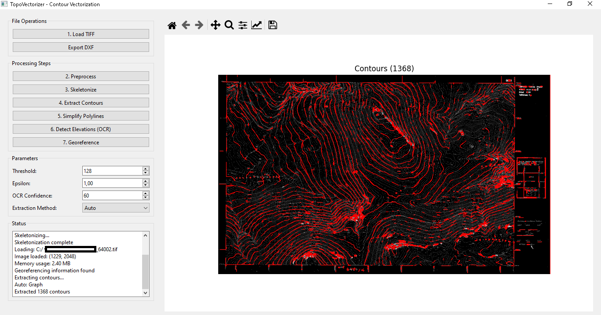

# TopoVectorizer - GIS Contour Vectorization Tool


**TopoVectorizer** is a professional desktop application for converting scanned topographic maps (TIFF/GeoTIFF) into vector formats (DXF, Shapefile, GeoPackage, GeoJSON). It automatically extracts contour lines, assigns elevations via OCR, and georeferences to the Greek coordinate system (EGSA87).



## ✨ Features

### Core Functionality
- **Raster Input**: Supports TIFF, GeoTIFF, and other raster formats with georeferencing
- **Image Preprocessing**: Thresholding, despeckle, morphology, and gap closing
- **Skeletonization**: Zhang-Suen and Lee algorithms for thinning contour lines
- **Contour Extraction**: Graph-based and OpenCV methods for robust line tracking
- **Polyline Simplification**: Douglas-Peucker algorithm for clean CAD polylines
- **OCR**: Automatic elevation detection from map text (250, 300, 350, etc.)
- **Georeferencing**: Transform pixel coordinates to EGSA87 (EPSG:2100)
- **3D DXF Export**: Create 3D polylines with elevation data
- **Multi-format Export**: DXF, Shapefile (.shp), GeoPackage (.gpkg), GeoJSON

### Additional Features
- **User-friendly GUI**: Built with PySide6 for intuitive workflow
- **Batch Processing**: Process multiple maps automatically
- **Memory Optimization**: Handles large TIFF files (10,000+ pixels)
- **Auto/Manual Method Selection**: Choose between Graph and OpenCV algorithms
- **Interactive Visualization**: Zoom, pan, and inspect results
- **Customizable Parameters**: Fine-tune threshold, epsilon, and OCR confidence

## 📋 Requirements

### System Requirements
- **OS**: Windows 10/11, Linux (Ubuntu 20.04+), macOS 10.15+
- **RAM**: 4GB minimum (8GB+ recommended for large maps)
- **Storage**: 1GB for application and dependencies

### Software Dependencies
- **Python**: 3.8 or higher
- **Tesseract OCR**: Required for elevation detection
- **GDAL**: Optional, for advanced GeoTIFF support

## 🚀 Installation

### 1. Install Python Dependencies

```bash
# Clone the repository
git clone https://github.com/belips-pan/topovectorizer.git
cd topovectorizer/src

# Install requirements
pip install -r requirements.txt

# Run the programm
python main.py

